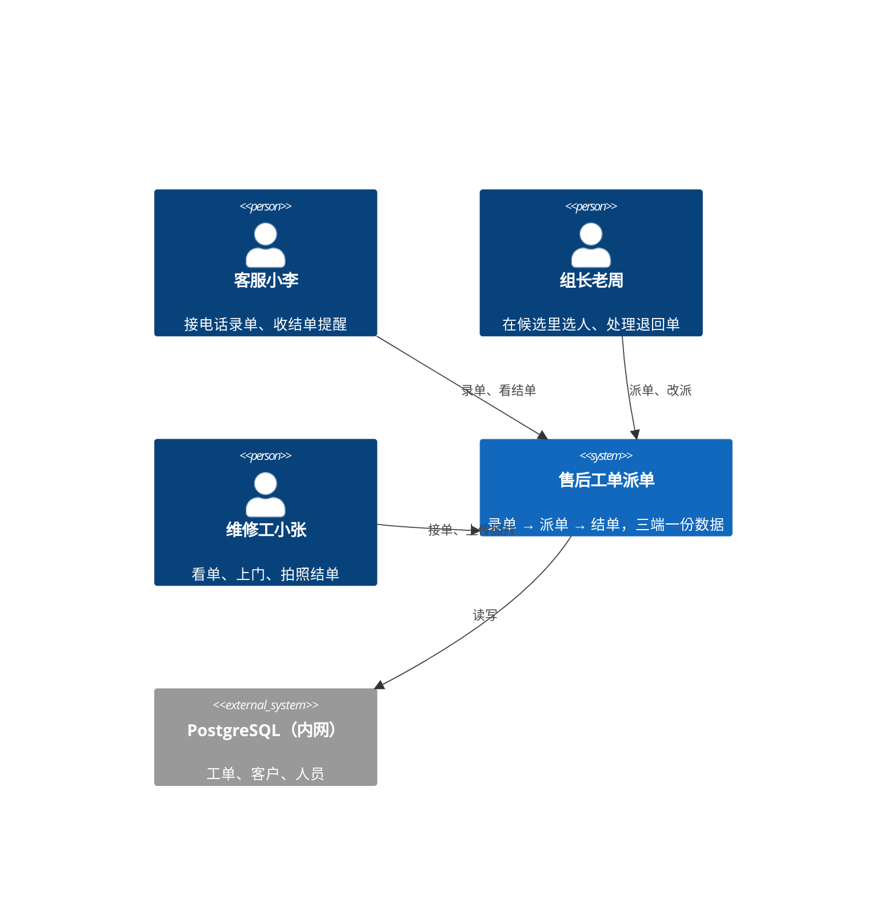
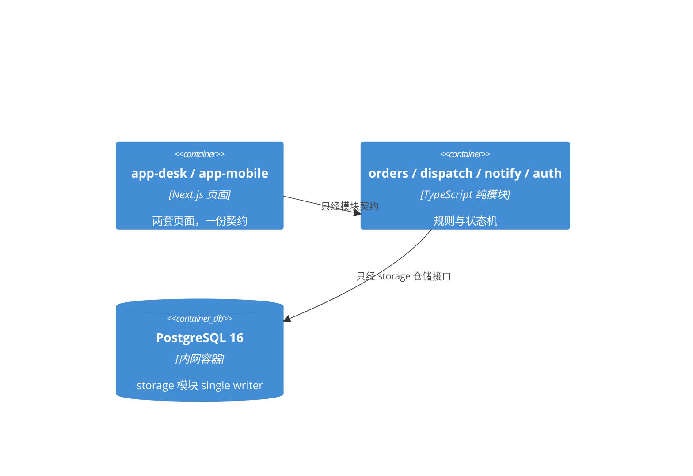
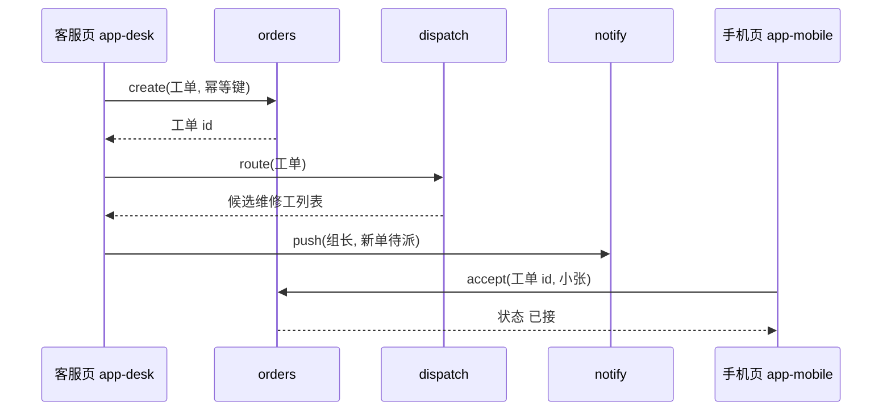

> 来源：cc-base/.claude/skills/arch-designer/examples/after-sales-dispatch-arch.md（整件收录，路径适配见本仓同名 skill）

# Architecture Design — 售后工单派单

> 生成：2026-09-10 · 档位：M · 路：Coaching · 状态：待批准
> 本文档只写不变量（两个独立构建的单元会在这上面选得不兼容的决定），其余是种子，代码一出现就归代码。M 档没有 module-catalog，依赖规则靠人工评审与 code-review Stage 2 守。
> 版本号为示例；真实项目在技术栈表钉死联网核过的精确版本。范例与 product-spec-builder/examples/after-sales-dispatch.md 配套，SCOPE / FLOW / Q 编号指向那份 Spec。

## 1. 架构概览

- **架构风格与命名范式**：模块化单体——Next.js 一个进程同时出页面与 API，范式「核心与适配」：`domain/` 放派单规则与工单状态机（纯函数，不碰框架），`app/` 放页面与 Route Handler（适配器），`storage/` 放 PostgreSQL 访问（被拒备选：微服务，理由见 ADR-1）
- **为什么是 M 档**：三种角色两种终端、派单规则有例外、通知要跨端——前端与后端若各自开工，会在「工单状态叫什么」「派单结果谁写库」上选不到一起；S 档的一页说明压不住这三处
- **技术栈**（钉死）：

| 名称 | 版本 | 角色 |
|---|---|---|
| Node.js | 22 LTS | 运行时 |
| Next.js | 15 | 页面 + Route Handler，一个进程 |
| TypeScript | 5 | 全栈类型；工单状态是判别联合，不是字符串 |
| Tailwind CSS | 4 | 样式，token 来自 DESIGN.md |
| PostgreSQL | 16 | 唯一持久化；内网 Docker 容器 |
| Drizzle ORM | 0.4x | 表定义与迁移，单向从 `storage/` 出 |

- **一句话数据流**：客服在桌面页录单 → Route Handler 调 `orders.create` 落库 → `dispatch.route` 按型号与 VIP 规则算出候选或直达人 → `notify.push` 推站内提醒 → 组长 / 维修工在手机页看到 → 维修工传照片 → `orders.close` → `notify.push` 给客服结单提醒
- **系统上下文（C4 L1）**：



## 2. 模块划分

| 模块 id | 职责（一句话） | 对外契约 | dependsOn | 禁依赖 | 变化原因（SRP 检验） | riskTier |
|---|---|---|---|---|---|---|
| app-desk | 客服桌面页：录单表单 + 待派列表 + 结单提醒 | 页面路由 `/desk/*` | orders, dispatch, notify, auth | storage | 客服的操作习惯变 | low |
| app-mobile | 组长 / 维修工手机页：候选选人、我的单、拍照结单 | 页面路由 `/m/*` | orders, dispatch, notify, auth | storage | 现场操作方式变 | low |
| orders | 工单与客户：建单、状态机（待派 → 已派 → 已接 → 已完工）、幂等键防重复建单 | `orders.create / accept / close / list` | storage | app-* | 工单生命周期定义变 | high |
| dispatch | 派单规则：按型号出候选、VIP 直达老张、休假退回组长、24 小时未接提醒 | `dispatch.route(order) → 候选或直达人` | orders | storage, notify | 派单规则变（SCOPE-2 / 4、Q-1） | high |
| notify | 站内提醒：新单、退回、结单；渠道可换 | `notify.push(to, event)` | orders | storage 直写 | 提醒渠道变（站内 → 企业微信） | medium |
| auth | 登录与三角色权限；客户电话字段的可见策略 | `auth.session / auth.can(role, field)` | storage | dispatch, notify | 角色或字段可见性变（Q-2） | high |
| storage | PostgreSQL 访问与迁移；所有表的 single writer 入口 | 仓储接口 `OrdersRepo / PeopleRepo` | — | 其余全部 | 存储方式变 | medium |

- **容器图（C4 L2，图即规则：谁可依赖谁）**：



## 3. 依赖规则

- **分层**（外 → 内，依赖只许向内）：app-desk / app-mobile → orders / dispatch / notify / auth → storage
- **禁边**：app-* ✗→ storage（页面不许直接写库）；notify ✗→ storage（提醒不落库，丢了就丢，工单状态才是事实）；dispatch ✗→ notify（派单算结果，推提醒是 orders 状态变化的副作用，由 app 层串起来）
- **数据所有权**：`orders`、`customers` 表归 orders 模块 single writer；`people`（维修工、会修型号、休假标记）归 auth 模块 single writer，dispatch 只读；客户电话字段的读取必须经 `auth.can(role, 'customer.phone')`，默认只有客服可见（Q-2 未定，默认值写在 auth 一处）

## 4. 一致性约定

| 关注点 | 约定（独立构建者会各写各的那些默认） |
|---|---|
| 命名（实体 / 文件 / 接口 / 事件） | 实体英文单数：Order / Customer / Person；文件 kebab-case；模块契约动词开头 `orders.create`；事件过去式 `order.closed` |
| 数据与格式（id / 日期时间 / 金额 / 错误形状 / 响应信封） | id 用 ULID；时间一律 UTC ISO 8601，页面按东八区显示；无金额；API 错误形状 `{ code, message, hint }`；成功不包信封，直接返回资源 |
| 状态与横切（变更方式 / 错误处理 / 日志 / 配置 / 鉴权） | 工单状态只经 `orders.*` 变更，页面不拼状态；错误不吞：捕获即记日志并向上抛；日志 JSON 一行一条、不含电话字段；配置只读环境变量；鉴权在 Route Handler 入口统一做，模块内不重复查 |

## 5. 扩展点（开闭原则落点）

| 易变轴 | 扩展机制 | 新增一种时改哪 |
|---|---|---|
| 派单规则（按型号 / VIP 直达 / 休假退回） | `dispatch/rules/` 策略注册表，按优先级顺序执行 | 加一个 rule 文件 + 注册一行，不改 `route` |
| 提醒渠道（站内 → 企业微信 / 短信） | `notify/channels/` 适配器接口 | 加一个 channel 文件，不改调用方 |

## 6. 关键场景走查

### 场景 1：FLOW-1 小李录单到小张上门
录单 → 落库（幂等键 = 客服 id + 客户电话 + 分钟级时间戳，断网重试不重复建单）→ 派单规则出候选 → 老周选人 → 推提醒 → 小张接单。边界可行：页面只调 orders / dispatch，写库只在 storage。



### 场景 2：FLOW-2 VIP 单老张休假
`dispatch.route` 先跑 VIP 规则：老张在 → 直达；老张标了休假 → 退回组长（`[默认]`，Q-1 未定）。失败路径：老张忘标休假，24 小时未接 → 定时任务扫 `orders.list({ 状态: 已派, 超时: 24h })` → 提醒老周并允许改派。定时任务住在 app 层，不进 dispatch。

## 7. 运行与部署包络

| 项 | 三态 | 内容 / 回来定的条件 |
|---|---|---|
| 环境（本地 / 测试 / 生产） | 决定 | 本地 docker-compose 起 PostgreSQL；内网一台测试机、一台生产机，同一镜像 |
| 部署拓扑（单机 / 容器 / 多实例） | 决定 | 单机单容器 + PostgreSQL 容器；同时在线不超过 20 人，不做多实例 |
| 基础设施与供应商（云 / 内网 / 数据库托管） | 决定 | 公司内网服务器，不对公网；PostgreSQL 自托管容器，数据卷在宿主机 |
| 运维（日志 / 监控 / 备份 / 发布与回滚） | 押后 | 日志到 stdout 由 docker 收；每日 pg_dump 到备份目录；监控与告警上线 30 天后或首次事故时回来定；发布 = 换镜像 tag，回滚 = 换回上一 tag |

## 8. 关键决策记录（ADR）

### ADR-1：模块化单体，不拆服务
- **状态**：accepted
- **背景与问题**：三种角色两种终端，团队三人；拆成派单服务、工单服务、通知服务各自部署，还是一个进程按模块隔离
- **决策驱动**：团队能力（三人无运维）、故障后果（单子不丢比可伸缩重要）、同时在线不超过 20 人
- **候选与优劣**：
  - 模块化单体：好——一套部署、一套日志、跨模块调试直接；坏——边界靠纪律守，没有网络隔离
  - 微服务：好——模块边界物理隔离；坏——三套部署三套日志、跨服务调试，三人团队养不起
- **决策**：选模块化单体，边界用 §3 依赖规则 + 目录结构守
- **后果**：好——两周能上线；坏——禁边只有人工评审守，记进 §11
- **被拒备选与理由**：微服务，因为负债大于收益（20 人在线不需要独立伸缩）
- **执法方式**：人工评审——code-review Stage 2 按 §3 禁边逐条核；上 L 档时改接 arch-check
- **revisit-if**：模块超过 10 个，或维护人数超过 5 人且要各自的发布节奏，或同时在线超过 200 人
- **reversal**：把派单模块拆成独立进程——`domain/dispatch` 原样搬走 + 加一层 HTTP 契约与它自己的部署与日志，约 2 周；数据不动（仍是同一个库）

### ADR-2：PostgreSQL 单库 + 幂等键防重复建单
- **状态**：accepted
- **背景与问题**：Spec 可靠性要求「提交成功即落库，断网重试不重复建单」；手机端微信浏览器断网常见
- **决策驱动**：SC-2 十分钟内到维修工手里、可靠性 P0、三人跨设备看同一份单
- **候选与优劣**：
  - 单库 + 幂等键（客服 id + 客户电话 + 分钟级时间戳唯一约束）：好——数据库层保证，不靠前端防抖；坏——同一客服一分钟内给同一客户录两单会被判重复（业务上不存在）
  - 前端防抖 + 无约束：好——实现快；坏——换个浏览器标签就失效
- **决策**：选单库 + 幂等键，约束落在 `orders` 表
- **后果**：好——重复建单为 0 可机器验证；坏——一分钟内同客户第二单要走「补录」路径，记进押后决定
- **被拒备选与理由**：前端防抖，因为不是保证只是概率
- **执法方式**：fitness no-silent-failure 守「落库失败不吞」；回归测试锁「同幂等键重放只建一单」
- **revisit-if**：`orders` 超过 500 万行，或需要按门店做多租户隔离，或真出现「同客服一分钟内给同客户建两单」的合法业务
- **reversal**：换幂等口径——改 `storage/orders` 与唯一约束 + 一次数据迁移与重放校验，约 3 天；换库（PostgreSQL → 别的）另算，`storage/` 全量重写约 2 周

### ADR-3：派单规则用策略注册表
- **状态**：accepted
- **背景与问题**：派单规则已知三条（按型号、VIP 直达、休假退回），Q-1 还可能加「24 小时未接改派」；规则写成 if 链还是可插拔策略
- **决策驱动**：可修改性（Spec 决策依据第 3 条：派单准优先于录单快）、可测试性（规则要能单测）
- **候选与优劣**：
  - 策略注册表：好——加规则不改 `route`，每条规则纯函数可单测；坏——多一层抽象，三条规则时显得重
  - if 链：好——一眼看完；坏——第四条规则开始互相纠缠，Q-1 一定会来
- **决策**：选策略注册表，规则按优先级数组顺序执行，首个命中即返回
- **后果**：好——新规则一个文件；坏——规则顺序成为隐藏契约，写进 `dispatch/rules/index.ts` 顶部注释
- **被拒备选与理由**：if 链，因为 Q-1 与 SCOPE-5 已经在敲门
- **执法方式**：人工评审——code-review 核「route 函数体只做遍历」；单测覆盖每条规则的命中与不命中
- **revisit-if**：规则超过 5 条且开始互相依赖（一条的结果影响下一条），或需要客户自己在界面上配规则
- **reversal**：退回 if 链或换成规则引擎——只动 `domain/dispatch/rules/` 一层与 `route`，每条规则的单测原样复用，约半天

## 9. 押后决定（Deferred）

| 决定 | 为什么可以等 | 什么条件下回来定 |
|---|---|---|
| 接口字段清单以代码为准 | 不会让两个单元不兼容，契约名已定 | — |
| 同客户一分钟内第二单的补录路径 | 业务上目前不存在 | 出现第一次真实案例 |
| 提醒渠道换企业微信 | 站内提醒够用，微信里点开即到 | 用户提「看不到提醒」超过 3 次 |
| 监控与告警 | 单机 20 人，人工重启可接受 | 上线 30 天或首次事故 |

## 10. 越档理由（恰如其分自检）

> 只在超出本档位默认深度时填；空表是好事。

| 越档项 | 为什么需要 | 更简单的替代为什么不行 |
|---|---|---|

无越档。

## 11. 风险与技术债

| 风险 / 债 | 来源（ADR / 押后） | 回收条件 |
|---|---|---|
| 禁边只有人工评审守 | ADR-1 | 模块超过 10 个或换人接手时上 L 档接 arch-check |
| 规则顺序是隐藏契约 | ADR-3 | 规则超过 5 条时改成显式优先级字段 |
| 备份只有每日 pg_dump | §7 押后 | 首次事故或数据量超 10 万单 |

## 12. 目录结构骨架

```
after-sales/
├── app/
│   ├── desk/          # 客服桌面页
│   ├── m/             # 组长 / 维修工手机页
│   └── api/           # Route Handler，鉴权入口
├── domain/
│   ├── orders/
│   ├── dispatch/
│   │   └── rules/     # 策略注册表
│   ├── notify/
│   │   └── channels/
│   └── auth/
├── storage/
│   ├── schema.ts
│   └── repos/
└── jobs/
    └── overdue.ts     # 24 小时未接扫描
```

## 13. 术语表

| 术语 | 含义 | 与 Spec 的对应 |
|---|---|---|
| 工单 Order | 一次上门维修的记录，状态机四态 | SCOPE-1 |
| 候选 Candidates | 会修该型号的维修工列表 | SCOPE-2 |
| 直达 Direct | VIP 单跳过组长直接给老张 | SCOPE-4 / FLOW-2 |
| 退回 Return | 直达人不在时单子回到组长待派 | Q-1 默认走法 |
| 结单 Close | 维修工上传照片后状态变已完工并提醒客服 | SCOPE-3 |

## 14. 七大原则自检记录

| 原则 | 结论 | 备注（过不了的写理由或整改项） |
|---|---|---|
| 开闭 OCP | ✅ | 派单规则、提醒渠道两处扩展点 |
| 依赖倒置 DIP | ✅ | 核心模块只依赖仓储接口 |
| 单一职责 SRP | ✅ | 每模块一个变化原因，见 §2 |
| 接口隔离 ISP | ✅ | `auth.can` 只暴露字段级判断 |
| 迪米特 LoD | ⚠️ | app 层同时调 orders / dispatch / notify 串流程，可接受，超过五步时抽 `usecases/` |
| 里氏替换 LSP | ✅ | 渠道适配器同一接口 |
| 合成聚合 CARP | ✅ | 规则以数组合成，不继承 |

## 15. 演进路线（本版不做但已预留）

- 先站内提醒；换企业微信只加 channel
- 先单机；多实例时只动部署与会话存储，代码不动

## 16. 待办与开放问题

- [ ] 等 DFX-Spec 补隐私档位后，确认 `auth.can` 的电话字段默认值（Q-2）
- [ ] dev-planner 阶段联网钉死技术栈精确版本
